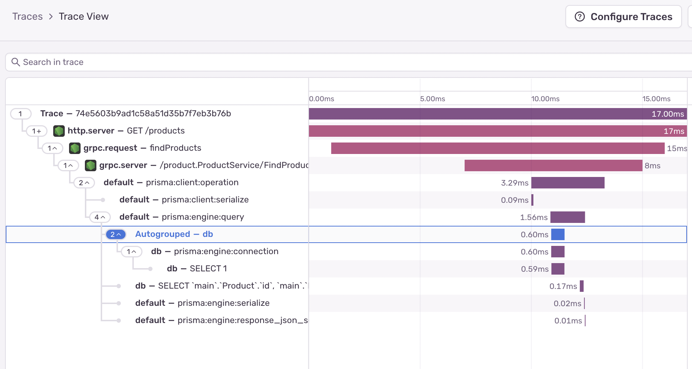
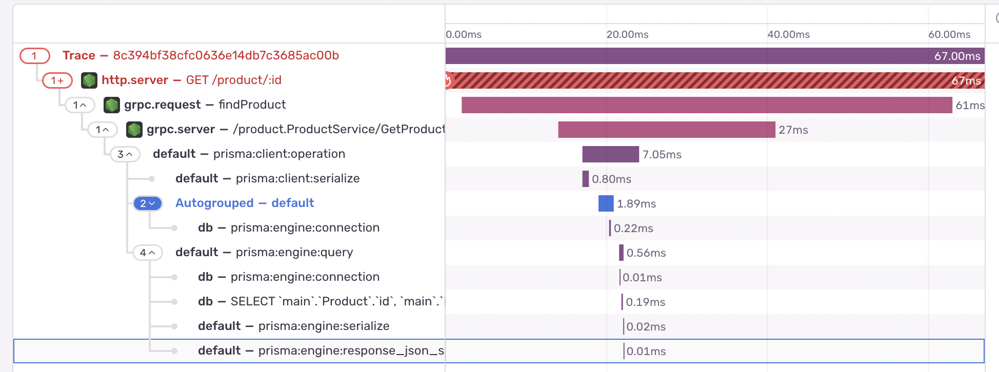

# gRPC Sentry

A koa microservice for product management. Features Sentry integration for error tracking, distributed tracing, and performance monitoring.

Use [gRPC project](https://github.com/jdaison/grpc-sentry) to do request to gRPC service.

## Prerequisites

- Node.js (v14+)
- Sentry account

## Quick Start

1. Clone the repository:

```bash
git clone https://github.com/jdaison/koa-sentry.git
cd koa-sentry
```

2. Install dependencies:

```bash
npm install
```

3. Configure environment:

```bash
cp .env.example .env
# Edit .env with your credentials
```

4. Start the service:

```bash
npm run dev
```

## Tracing

This project includes distributed tracing using Sentry. Below are some example traces captured by Sentry:

### Tracing find products



### Tracing get product with error


